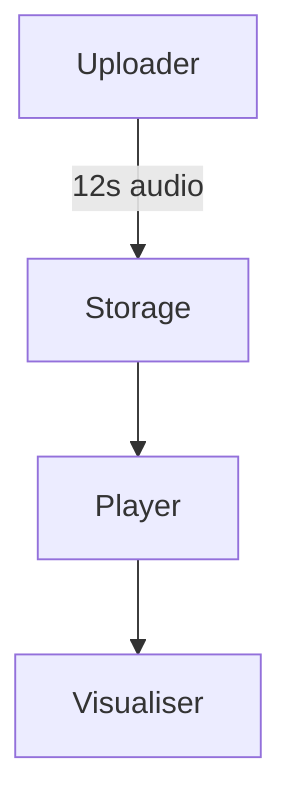

# Architecture Overview

This simplified diagram shows the core pieces: an uploader stores a short loop, the Web Audio player retrieves it, and the AWaves visualiser renders motion based on the audio analysis.
